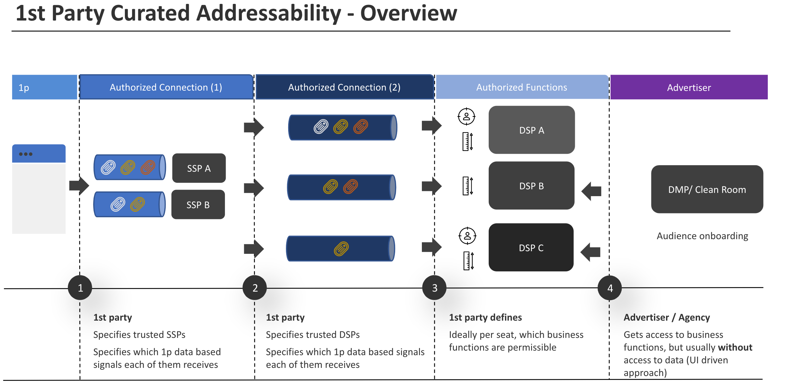

### General approach

The general approach for a tangible way to address the defined problem statement is depicted below, **the accepted caveat** is that it assumes that **known parties** transact under defined conditions (contractual relations).

The idea is to reach the desired goals with enough flexibility for both buy and sell side to address business imperatives and a sustainable minimum set of guarantees preventing data leakage and controlling data use. Within today's ecosystem contractual relations exists **already** between

1. Publisher/Sales House - Adserver/SSP (context step 1)
2. Adserver/SSP - DSP  (context step 2)
3. as well as DSP - Agency/Advertiser  (context step 4)

In addition to that this approach assumes a contractual relation between Publisher/Sales House - DSP(in context step 3).

1. Starting from a **sell side perspective**: Publishers define which ids/data they want to provide to the SSP/AdServer of choice (depending if this is a bidding or attribution scenario) - both act as a data processor for the publisher. Additionally publishers can **at a minimum** define which buy side platform should be provided with that data.

    **The goal** is to allow this on a **buy side seat level** via a structured (likely JSON based) configuration format. This could be achieved via Bidadapter Configurations as already present today within PreBid UserID handling to control data flows within bidding.

2. **Bidding, Matching:** The largest area of concern for data leakage is during bidding - matching calls (as long as 3p cookie depreciation is not in full effect).

    **Overall goal** is to switch over **to server side bidding** for any 1st party data enabled campaign. Publishers are able to disable client side matching in the context of 1p data/IDs. Publishers are able to control if 1p IDs may be transmitted with others in bid-requests; The ideal setup in terms of control would be bid signals on a demand plattform seat level, where publishers define permissible use of data (per function) in a structured format.

3. **DSPs use of available** IDs/data is agreed upon with Publishers in a mix of a contractual agreement in combination with (at best on a per function/seat level) configuration provided.

    Signaling permissible data use (on the functional level) during bidding as a real-time signal would be an option, given this might introduce too much overhead (specifically if done on the DSP seat level) an out of band mechanism similar to sellers.json would suffice.

4. **Advertisers** are enabled (DSP wide/seat level) to **leverage** publisher 1p data for agreed upon functionality.

&gt;&gt; [Functionality](1-2-functionality.md)